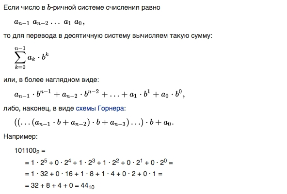

# Позиционная система счисления

Это система счисления, в которой значение каждого числового знака (цифры) в записи числа зависит от его позиции (разряда).

## Перевод в десячичную систему счисления

Если число в  b-ричной системе счисления равно  

